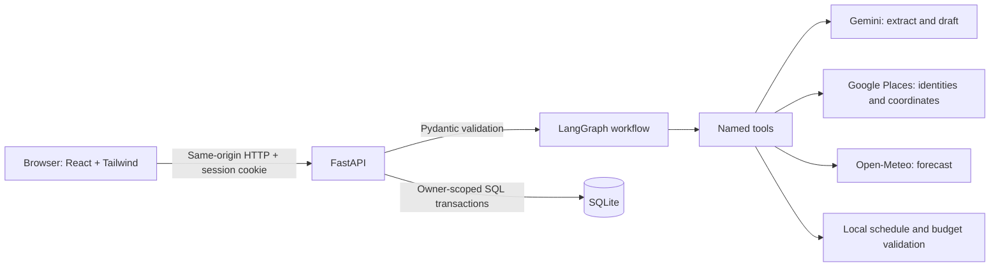
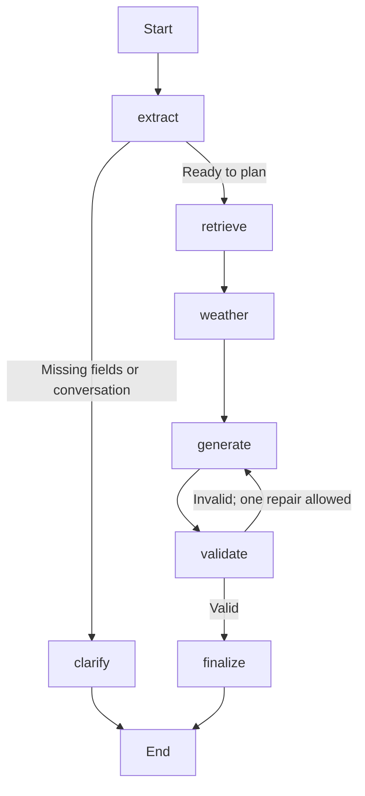
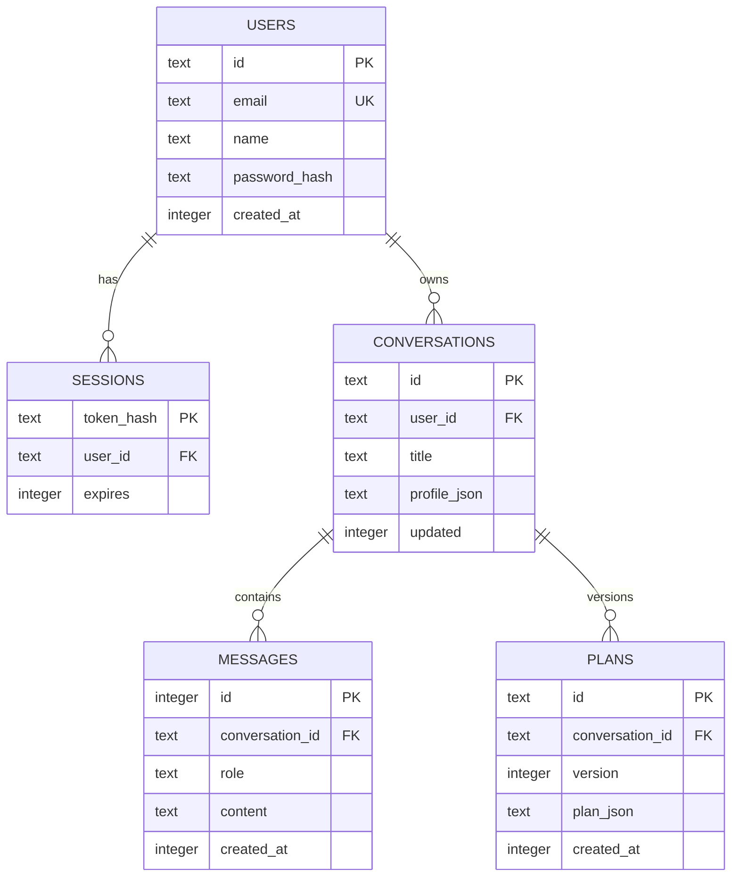

# Roam: Business Requirements and High-Level Design

## 1. Problem and users

Travel planning requires coordinating preferences, activities, timing, expenses and packing.
Users repeatedly switch between search, maps and notes, then redo their work when preferences
change. Roam provides one conversational workspace for a short leisure trip.

Primary users: solo travelers, couples and small groups planning a 1–7 day visit. User needs:
express preferences naturally, receive a usable plan, understand uncertainty and cost, revise
it, and return to saved work. No payments or reservations are performed.

## 2. Business requirements and acceptance criteria

| ID | Requirement | Acceptance |
|---|---|---|
| BR-01 | Personalized conversation | Extract destination, dates, duration, travelers, budget, interests; ask for missing required values |
| BR-02 | Daily activity plan | Exactly the requested number of days, every activity references a retrieved place ID |
| BR-03 | Budget planning | Group costs by accommodation/food/local transport/activities/contingency; calculate total and shortfall in code |
| BR-04 | Packing checklist | Produce relevant packing suggestions; let users tick items while viewing the plan |
| BR-05 | Weather context | Fetch forecasts for covered trip dates; disclose unavailable dates/provider failure |
| BR-06 | Follow-up edits | Reuse conversation/preferences and regenerate a validated replacement; preserve prior plan on failure |
| BR-07 | Authentication | Register/login/logout with hashed passwords and server-side sessions |
| BR-08 | Private saved work | Restrict every conversation read/write/delete to its owner |
| BR-09 | Data controls | Download current plan as JSON; delete conversations or the entire local account |
| BR-10 | Explainable workflow | Named tools, typed schemas, node trace, source labels and explicit assumptions |

Assumptions: budget covers the whole group and excludes travel to/from the destination;
accommodation covers days minus one nights; costs are estimates, not quotes. Public demo
APIs can reject requests or throttle usage. Internet is required for new plans, but saved
plans remain in the local database. Curated mock providers exist only in the test suite.

## 3. System architecture

During development Vite proxies `/api` to FastAPI; the browser sees one origin. A built
frontend can be served directly by FastAPI. Services bind to loopback for this local demo.

### Workflow and tool mapping

| Node | Tool | Meaningful operation |
|---|---|---|
| extract | extract_preferences | Gemini extracts typed preferences and distinguishes planning from conversation |
| clarify | check_missing_preferences | Finds missing required fields without an extra API call |
| retrieve | search_destination_places | Retrieves place identities and coordinates from Google |
| weather | fetch_trip_weather | Fetches date-filtered forecast; explicitly handles missing coverage |
| generate | draft_grounded_itinerary | Produces a schema-validated proposal from retrieved data |
| validate | validate_itinerary | Enforces IDs, day counts, timing/buffers and calculates decimal cost totals |
| finalize | package_travel_plan | Validates the final response, attaches source provenance and authoritative budget check |

The compiled graph is independently exported to `workflow.mmd`. Nodes call LangChain
`StructuredTool` objects with Pydantic `args_schema`. Workflow state uses TypedDict; tool
boundaries and both draft/final payloads use Pydantic. This avoids assuming state annotations
alone validate every intermediate update.

The API persists a complete turn only after the graph succeeds. It reloads conversation
state from SQLite for each request. It does **not** claim LangGraph checkpoint/resume support
mid-request: a process crash requires retrying that turn.

## 4. Data model

Relational ownership, sessions and messages are normalized; plan snapshots use JSON because
the UI consumes a complete validated itinerary and does not query individual stops. The
compound `(conversation_id, version)` constraint prevents duplicate versions. Foreign keys
cascade deletes. Indexes cover user conversation lists, ordered messages and latest plans.
WAL and short transactions reduce contention; no SQL transaction spans network calls.

## 5. LLM and prompt design

Two responsibilities use separate prompts: preference extraction and grounded itinerary
generation. Both include the appropriate Pydantic-generated JSON schema. Gemini JSON mode is
followed by actual `model_validate_json`; the implementation does not claim provider-level
strict constrained decoding. One bounded schema repair is allowed per structured call.

Extraction includes current date, previous preferences, recent conversation and previous
plan. Missing information stays null. Generation receives source records and forecast, group
budget semantics, allowed time window and visit buffers. User/retrieved text is explicitly
treated as data, and cannot change endpoints or invoke arbitrary tools.

Pydantic checks shape, types, ranges, lengths, finite costs and real calendar dates. Local
business validation additionally checks place membership, same-day duplicates, correct day
count and non-overlap. One graph repair is allowed. Unrecoverable errors do not overwrite the
last saved plan. Over-budget results remain visibly over-budget: cost feasibility and real
travel feasibility cannot be proven from these data sources.

This is retrieval-augmented generation from live place records, not a vector database RAG
system. Retrieval grounds identity/location only; admission, descriptions and durations are
still model suggestions. Sources and limitations are visible in the UI.

## 6. Security and privacy

- Argon2id password hashes; no plaintext passwords or AI access to login details.
- Cryptographically random session tokens; only SHA-256 digests are stored server-side.
- HttpOnly, SameSite=Strict cookies. `COOKIE_SECURE=true` required behind HTTPS deployment.
- Owner predicates on conversation reads, writes and deletes; parameterized SQL.
- Origin checks for mutations and no permissive CORS.
- Request schemas/length limits, auth and AI throttling, one active generation per user.
- API keys loaded by the backend only; no raw provider error bodies or credential logging.
- React renders AI/user text as text, without `dangerouslySetInnerHTML`.
- Account/conversation deletion and plan export are available.

Stored PII is name/email plus whatever the user chooses to type. UI discloses transmission
of messages to Gemini, place queries to Google and coordinates to Open-Meteo. The app cannot
guarantee a provider's retention policy. Local SQLite is not encrypted. OS disk encryption,
private backups, email verification, password recovery and MFA are deployment work.

## 7. Performance, reliability and scaling

Current: async HTTP clients reused across requests; 30-minute bounded weather cache; recent
12-message prompt context; short SQL transactions; indexes; timed upstream requests; one
transient network retry; one schema repair; one itinerary repair; four-minute overall cap.
External rate limits are surfaced, not bypassed. The happy path uses two LLM requests, a
Places query, and a weather query (unless cached).

Single-worker local prototype: SQLite and process-local throttles/concurrency state are not
distributed. For production, use PostgreSQL, Redis-backed quotas/locks, pagination/retention,
bounded job queues, streaming progress, HTTPS, provider quotas and failure monitoring.
Recheck Maps licensing/retention, attribution and demo-key restrictions before public release.

## 8. Stack decisions

React/Vite/Tailwind preserve the familiar frontend stack and enable responsive components.
FastAPI/Pydantic give typed contracts and generated API docs. LangGraph makes branching and
bounded repair inspectable. Explicit tools prevent the model from choosing unrestricted
actions. SQLite requires no extra service account; it is appropriate for a local demo.
Gemini uses the key available to the user. Maps supplies real locations without requiring
the unavailable photo APIs. Open-Meteo supplies weather without another credential.

## 9. Value and future opportunities

Value hypothesis: less repeated planning, fewer fabricated places and clearer budget tradeoffs.
Measure time-to-first-usable-plan, number of revisions, plan-save/export rate, grounded-place
coverage, schema-failure rate and cost per successful plan in a future user study. No measured
ROI or adoption claim is made. Future work: route durations, verified ticket data, multi-city
trips, budget optimization, group collaboration and booking-provider integrations.
