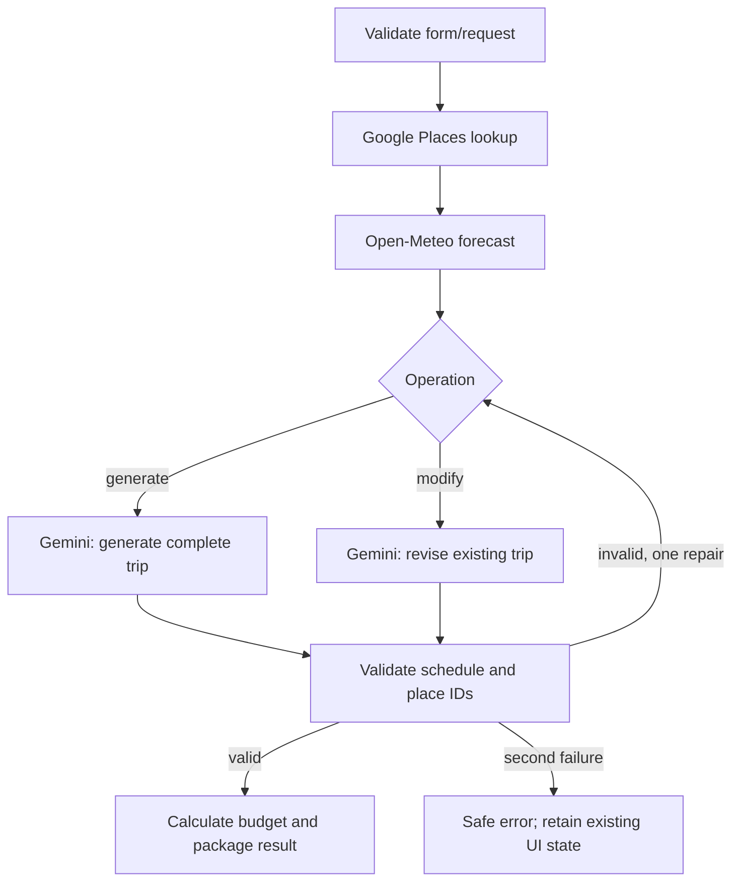

# TripAI backend: setup and frontend contract

**Final product decision:** TripAI is field/schema inspiration only. We built our own
Roam frontend in `src/`, including `components/TripForm.jsx`. No separate Next.js source
is required. The guided form uses authenticated `/api/chats/{id}/preferences`, validates
the same `TripPreferences`, maps them to the saved-chat profile, and invokes the existing
chat graph with local `validate_form_profile` instead of AI preference extraction.
Plans and subsequent chat revisions are saved in the existing SQLite conversations.
Run `npm.cmd run dev` and open `http://localhost:5173` for this final frontend.

The standalone `/api/tripai/plan` contract and optional Next.js integration notes below
remain reference material, not a prerequisite or a pending task for the final product.

This module implements the generation and modification workflow described in the
supplied Next.js README. It reuses the installed Windows Python environment, existing
Gemini/Google keys, provider adapters, and local session authentication. No RAG pipeline,
embeddings, vector database, extra API account, or Next.js dependency was added.

**Integration boundary:** the actual `travel-ai` project was not found under
`Prodapt_Hackathon`. Its README describes types but does not give their exact property
names/unions. The Python contract below is therefore explicit and provisional, not a
claim that the unseen TypeScript already matches. No Next.js files were modified.
The original React chatbot still works separately.

## Run on your Windows computer

From PowerShell:

```powershell
Set-Location 'C:\Users\Aditya Ram\Prodapt_Hackathon\trip-chat'
.\.venv\Scripts\python.exe -m uvicorn backend.app:app --host 127.0.0.1 --port 8000
```

Open **http://localhost:8000/docs**. This is the interactive API interface, not the
Next.js UI. Stop an existing backend on port 8000 first; Ctrl+C stops this server.
Dependencies are already installed. The backend reads `../API.txt`; do not copy keys
into frontend code or `NEXT_PUBLIC_` variables.

1. Expand `POST /api/auth/register`, click **Try it out**, and enter a name, email,
   and password of at least 10 characters. Execute it. Use a throwaway demo account.
2. If already registered, use `POST /api/auth/login` instead.
3. The browser retains the HttpOnly session cookie. `GET /api/auth/me` checks login.
4. Expand `POST /api/tripai/plan`, click **Try it out**, and send the generation JSON below.
5. Set both dates to future dates before running. Gemini/Google calls consume quota.
6. Copy the returned `trip` object into `existingTrip` to try a modification.

Generation request:

```json
{
  "operation": "generate",
  "preferences": {
    "destination": "Jaipur, India",
    "startDate": "2026-10-10",
    "endDate": "2026-10-12",
    "travellers": 2,
    "totalBudget": 25000,
    "interests": ["Culture", "Food"],
    "style": "Relaxed",
    "requirements": "Avoid strenuous walks. Flag places whose accessibility needs checking."
  }
}
```

Modification request shape (replace `existingTrip` with the complete returned trip):

```typescript
const request = {
  operation: "modify",
  existingTrip: currentTrip,
  modification: "Make day two cheaper and less busy",
};
```

There is no simulated timer or keyword substitution in this backend. It calls Gemini.
If a provider fails, the API returns a safe error and does not replace the caller's trip.
An earlier live check of the older Groq workflow reached its usage limit. New tests
use fake providers; this new TripAI workflow has not been verified live end-to-end.

## Requested files and tools

All paths are relative to `trip-chat`:

| File | Responsibility |
|---|---|
| `backend/tripai/schemas.py` | Form, operation, Trip, activity, packing, budget, draft, tool-input and result contracts |
| `backend/tripai/nodes.py` | Thin orchestration: every node invokes a meaningful named tool |
| `backend/tripai/graph.py` | Generation/modification routing and one bounded business-validation repair |
| `backend/tripai/tools.py` | Provider calls, grounding checks, frontend mapping and deterministic budget totals |
| `backend/app.py` | Authenticated endpoint, shared rate limit, per-user concurrency guard and timeout |
| `tests/test_tripai.py` | Contract, generation, revision, arithmetic, failure and API tests |



| Node | Actual tool |
|---|---|
| intake | `validate_trip_request`: operation/form/date checks |
| places | `lookup_trip_places`: Google Places API |
| weather | `lookup_trip_weather`: forecast API, coverage warnings |
| generate | `generate_trip_draft`: Gemini structured JSON with Pydantic validation |
| modify | `revise_trip_draft`: Gemini revision using existing trip and request |
| validate | `validate_trip_draft`: known IDs, schedule, day count, unique IDs |
| finalize | `calculate_trip_budget`: Decimal arithmetic, overspend flags, final Pydantic result |

The provider layer also allows one JSON-schema repair per LLM call. The graph allows
one business-validation repair. These are separate, bounded retry mechanisms.

## Contract decisions

- Preferences use `travellers`, `totalBudget`, `startDate`, `endDate`, `interests`,
  `style`, and `requirements`. Dates are inclusive: October 10–12 is three days/two nights.
- Backend scope is **2–7 days**, 1–12 travellers, INR 1,000–10,000,000 in increments of
  100. The frontend README has no maximum duration; add the same seven-day limit to its
  form or consciously extend the backend and token budget. Same-day trips are rejected,
  matching the form's end-after-start requirement.
- Interest values use the title-cased labels in the README; style is Relaxed/Balanced/Packed.
- `Trip` fields: `id`, `region`, `tagline`, `artwork`, `preferences`, `days`, `fixedCosts`, `packing`.
- `Activity`: `id`, `time`, `title`, `description`, `location`, `cost`, `duration`,
  `category`, `budgetCategory`, `updated`. Title/location come from retrieved records.
- Packing sections use `{id, name, items: [{id, name, checked}]}`.
- `fixedCosts` contains accommodation, transport and miscellaneous only. Food and
  activities are summed from itinerary entries once; they are not added again as fixed costs.
- Response envelope: `{trip, budget, weather, warnings, notes, trace}`. Use `response.trip`
  as dashboard state, not the whole envelope. Render warnings/notes visibly.
- `budget` contains `breakdown`, `estimatedSpend`, `remaining`, `withinBudget`.
- Local artwork identifiers are provisionally `goa`, `jaipur`, `manali`; other destinations
  get generic Goa artwork with an explicit warning. Confirm against `DestinationScene`.
- Modification preserves trip ID, preferences, packing list and checked state. Day IDs
  and activity-slot IDs are retained by position. Insertions/removals are not semantic ID
  matching; reset relevant UI state if that distinction matters. Changed slots are marked
  `updated`; unrelated content preservation is prompted, not guaranteed by the LLM.
- Revisions cannot change destination, dates or traveller count; submit a new generation
  for those changes. Packing-list regeneration is not part of itinerary modification.

## Connect the Next.js frontend once its source is available

1. Compare `src/types/trip.ts` with these schemas. Add a typed adapter where names/unions
   differ. Do not hide mismatches using `as Trip` or `any`.
2. Merge a same-origin API rewrite into the **existing** Next configuration, preserving
   other settings. Example rule: source `/api/:path*`, destination
   `http://127.0.0.1:8000/api/:path*`. Do not overwrite existing routes/configuration.
3. The backend permits local origins on ports 3000, 5173 and 8000 by default. If `.env`
   defines `ALLOWED_ORIGINS`, add `http://localhost:3000` there too, then restart Python.
   The rewrite is necessary: no permissive cross-origin CORS configuration was added.
4. Add login/register UI using the existing `/api/auth/*` endpoints via that same-origin
   proxy. Registering at port 8000 and using port 3000 on the same `localhost` hostname
   also shares the local cookie for a development-only manual test. Do not mix localhost
   and 127.0.0.1; cookies are hostname-specific.
5. Replace the fixed Goa redirect with `POST /api/tripai/plan` using the form preferences.
   Show loading until completion, not a fixed success timer. Retain input on errors.
6. Replace `simulateTripUpdate()` with the same endpoint using `operation: "modify"`.
   Update state only after a successful response. Keep the previous state on failure.
7. Replace the static `generateStaticParams`/seeded lookup for generated UUIDs: the current
   sample routes will not resolve new trips. A client-side result screen can demonstrate
   generation, but durable `/trip/[id]` and My Trips need owned persistent storage.

The new endpoint is intentionally **stateless**. It neither stores nor retrieves TripAI
trips and does not treat a submitted ID as authorization to a stored record. Existing
chat persistence uses a different plan format and is left untouched. Packing clicks,
new trips and modifications will not survive reload until frontend/storage integration
is implemented. Do not claim the Next.js mock frontend is already connected.

## Verification and exports

```powershell
.\.venv\Scripts\python.exe -m pytest tests -q
.\.venv\Scripts\python.exe -m backend.tripai.export
```

The full suite passed **51 tests**, including 18 new TripAI cases. Tests cover generation,
revision, schema limits, invalid dates, budget consistency, overspending, preserved packing,
bounded repair, weather outage, authentication and origin rejection. No live calls are
made by these tests. JSON schemas and the compiled Mermaid graph are exported under
`docs/tripai-contract/`.

Current limits: provider quotas apply, prices are estimates, restaurant discovery is not
specialized (the current Places adapter retrieves tourist attractions), no opening-hours
or route verification, and no guarantee of dietary/accessibility compliance. Do not enter
medical or other sensitive personal data in requirements. Only necessary trip data is
sent to providers; credentials and account identity are not included in prompts.
